## hse_hw1_meth

[Google коллаб](https://colab.research.google.com/drive/11Heblh6Wg-uCqgD31M1V6CzjrtOucr_5?usp=sharing)

8cell.

Цитозина стало заметно меньше относительно обычных ридов. Тимина, наоборот, сильно больше.

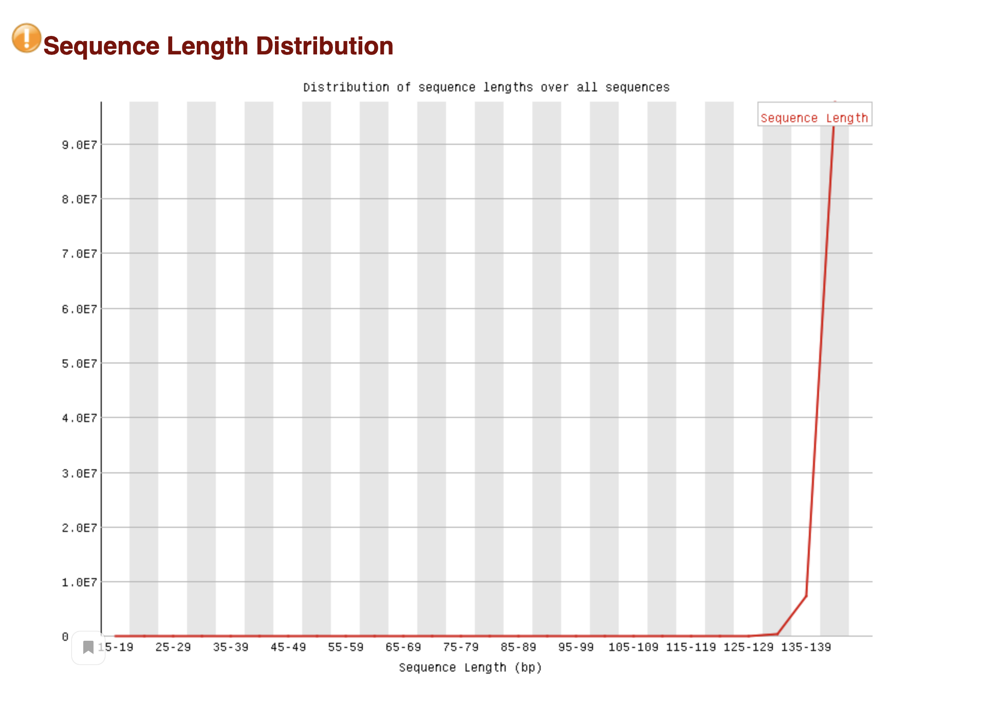
Длины ридов по распределению не сильно, но отличаются от нормы.

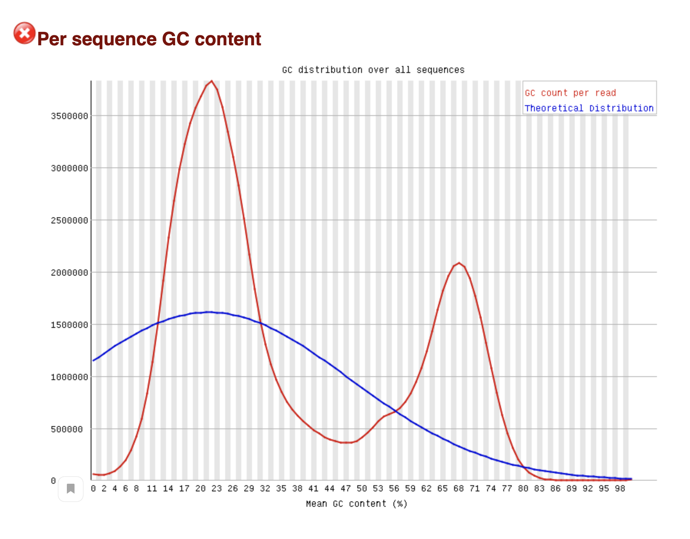

Распределение GC content имеет несколько пиков, не является нормальным распределением.

По сравнению с предыдущими анализами нет адаптера, пропуски и дупликации ожидаемы.

## Участок хромосомы. Чтения

| name     |1347700-11367700  |  40185800-40195800 |
|----------|------------------|--------------------|
| 8cell    |  1090            |  464               |
| icm      |  1456            |  630               |
| epiblast |  2328            |  1062              |

## Дуплицированные чтения

| name     | percent |
|----------|---------|
| 8cell    | 18.31 % |
| icm      | 9.08 %  |
| epiblast | 2.92 %  |

### M bias plots
8cell m-bias plots:
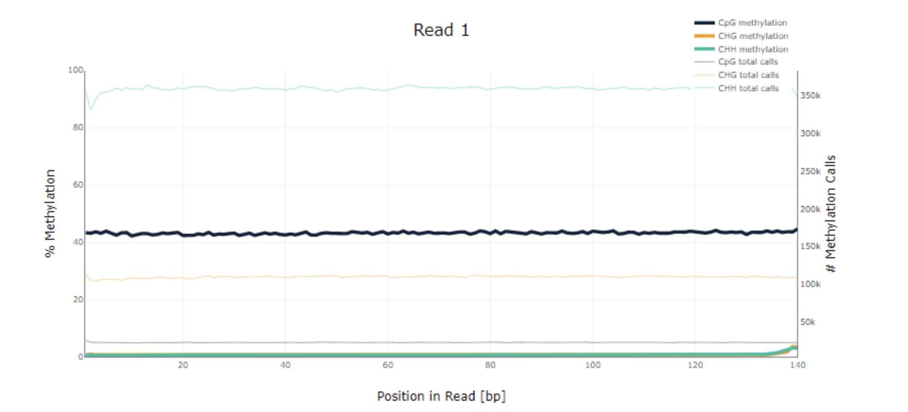

icm m-bias plots:
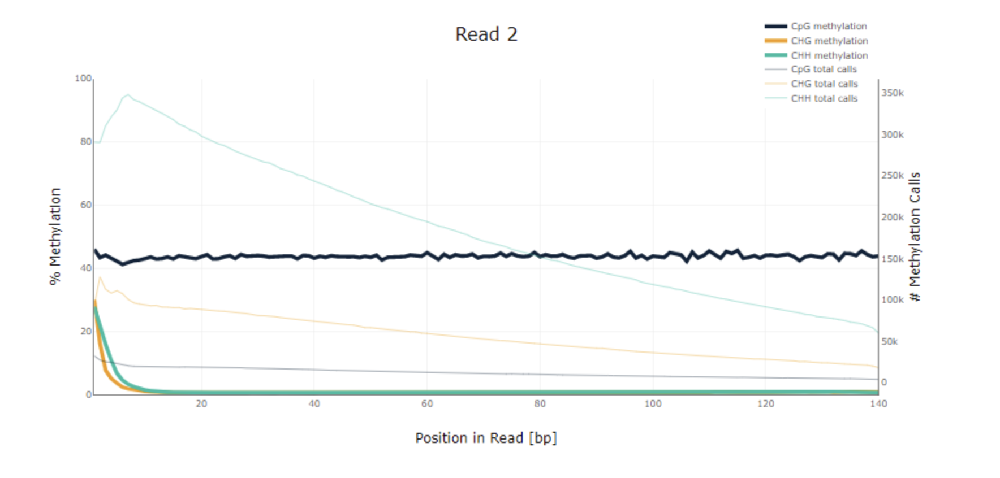
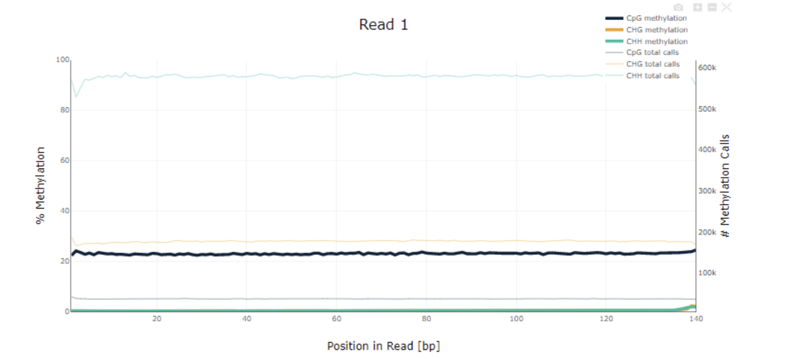

epiblast m-bias plots:
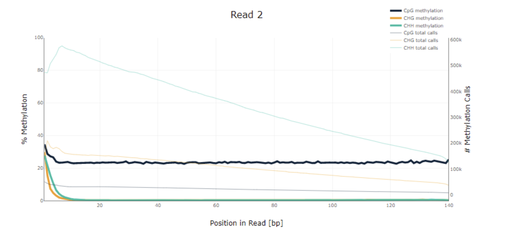
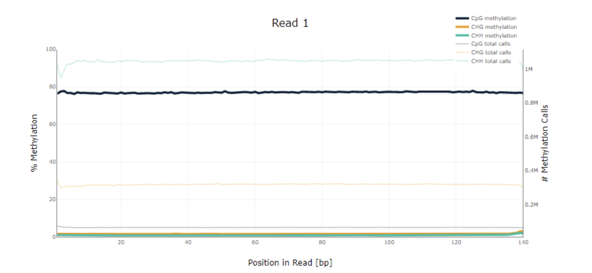

В нашем дз нам нужно обратить внимание на CpG, для них графики около константы, за исключением иногда возрастания\убывания в начале сторону уменьшения позиции. Объектов других видов относительно этого немного, но они имеют большее отклонение. Но опять же, в целом их немного.

## Гистограммы bismark cov

8cell:
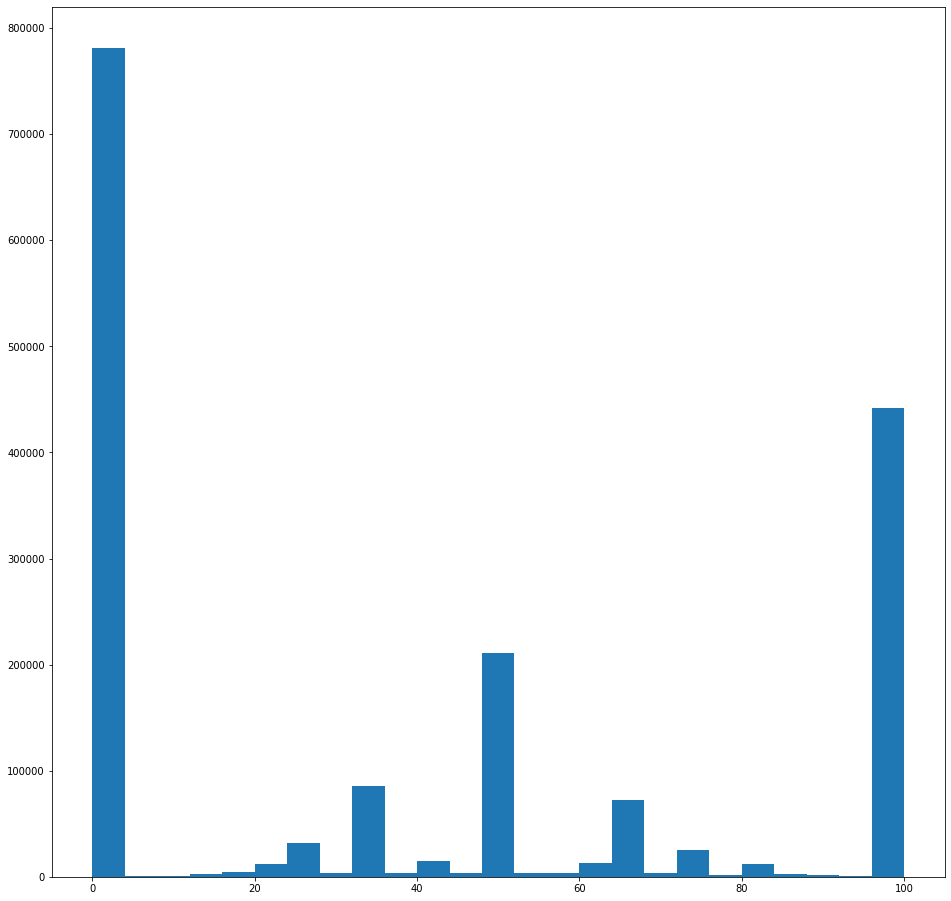

icm:
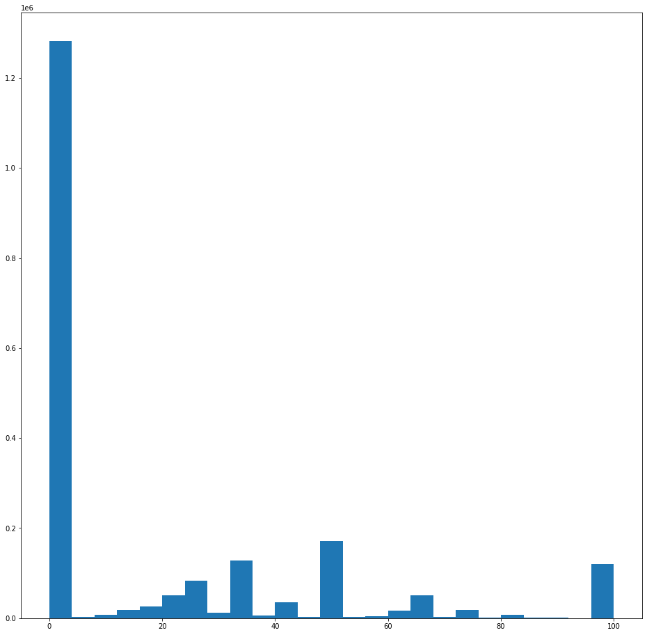

epiblast:
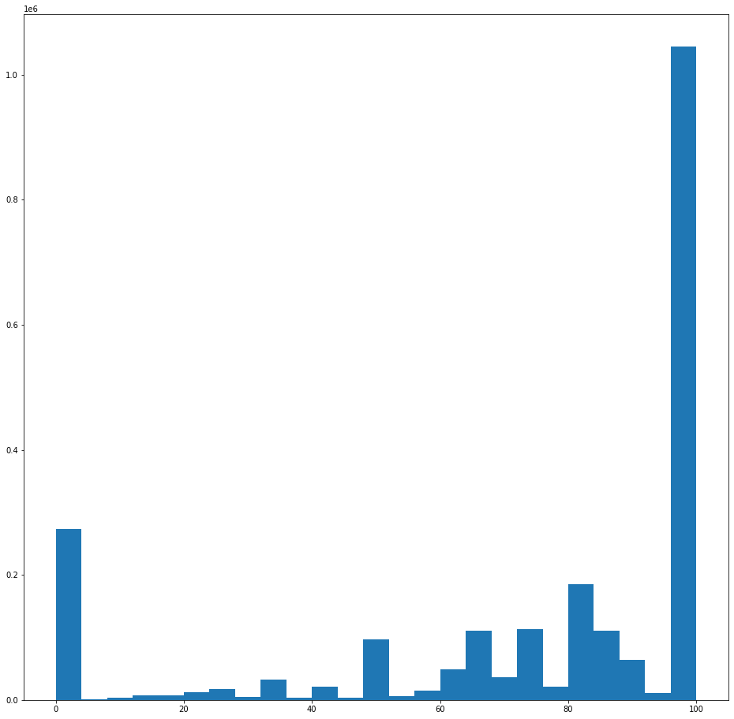

По гистограммам видно, что сначала большинство значений возле нуля, а после - резко в 100%.

###

8cell:
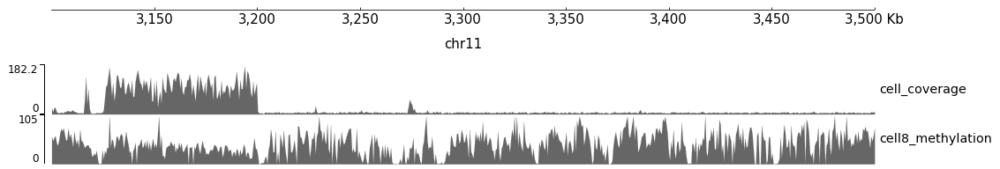

icm:
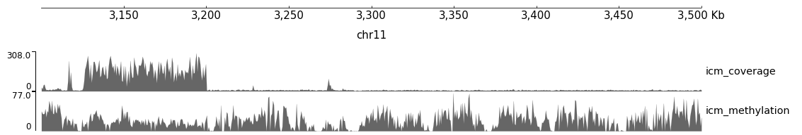

epiblast:
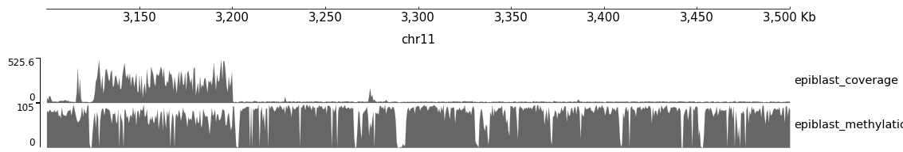
