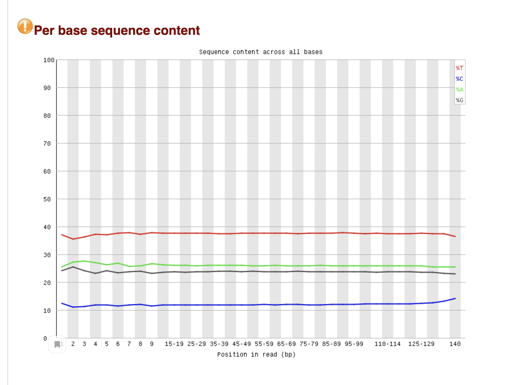

## hse_hw1_meth

[Google коллаб](https://colab.research.google.com/drive/11Heblh6Wg-uCqgD31M1V6CzjrtOucr_5?usp=sharing)

8cell.

Цитозина стало заметно меньше относительно обычных ридов. Тимина, наоборот, сильно больше.

Длины ридов по распределению не сильно, но отличаются от нормы.

Распределение GC content имеет несколько пиков, не является нормальным распределением.

По сравнению с предыдущими анализами нет адаптера, пропуски и дупликации ожидаемы.

## Участок хромосомы. Чтения

| name     |1347700-11367700  |  40185800-40195800 |
|----------|------------------|--------------------|
| 8cell    |  1090            |  464               |
| icm      |  1456            |  630               |
| epiblast |  2328            |  1062              |

## Дуплицированные чтения

| name     | percent |
|----------|---------|
| 8cell    | 18.31 % |
| icm      | 9.08 %  |
| epiblast | 2.92 %  |

